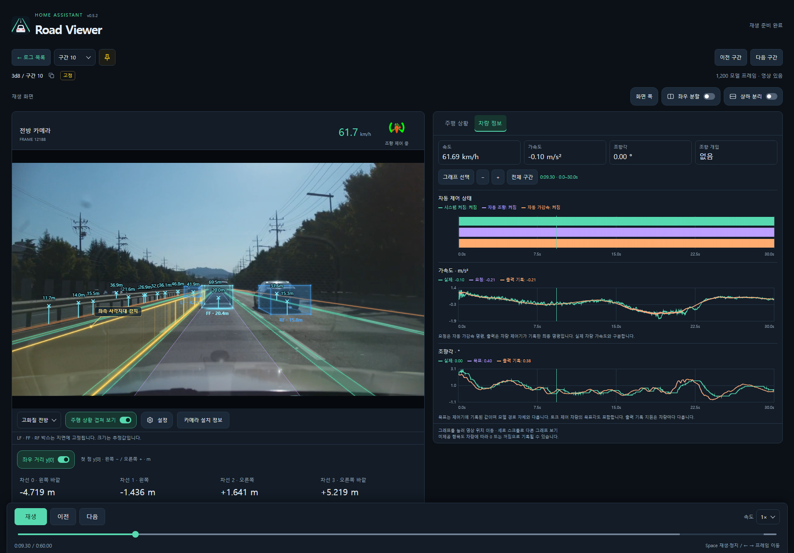
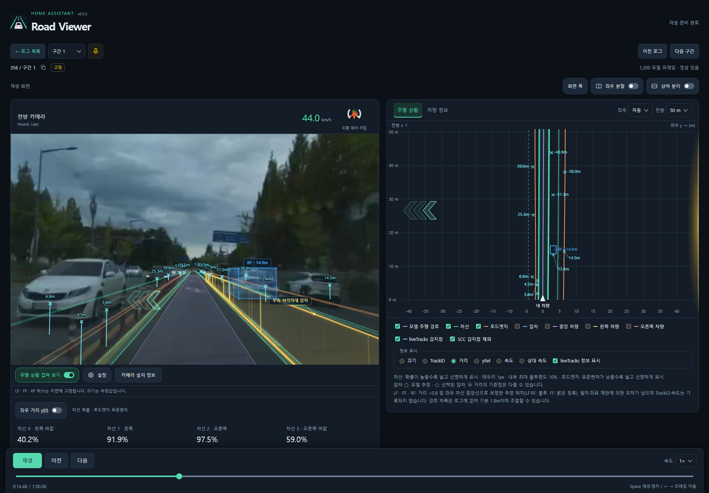
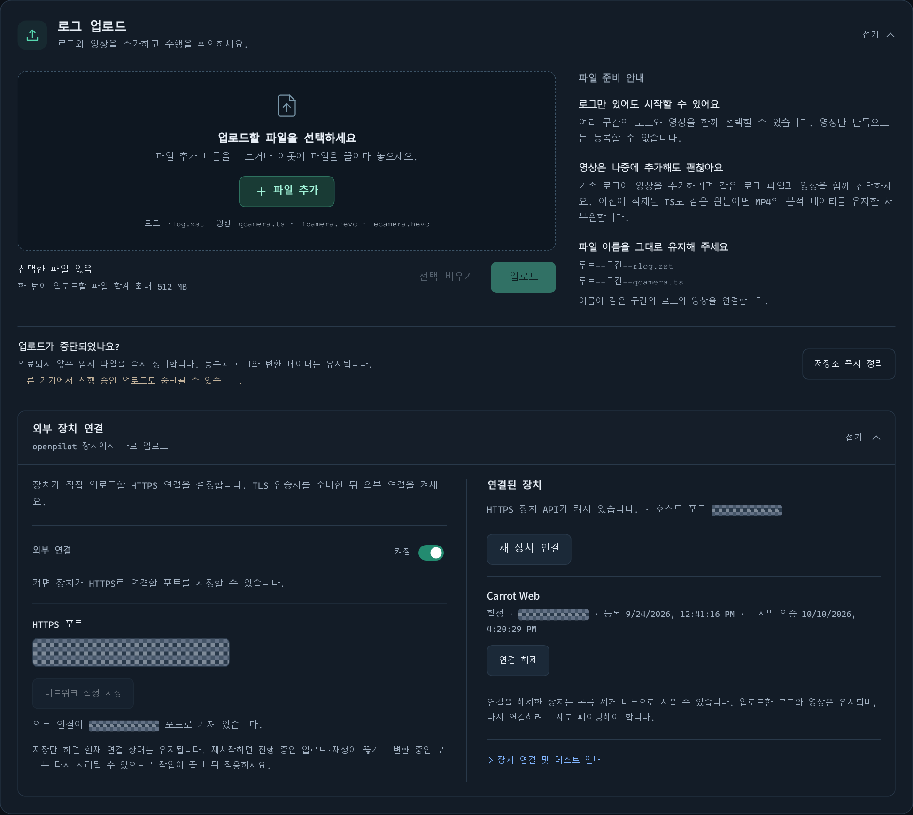
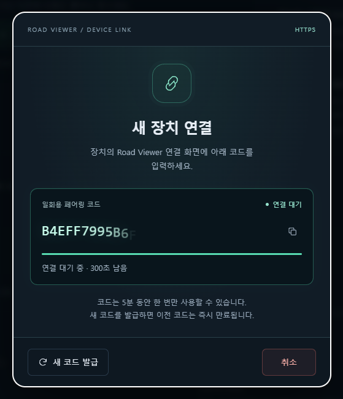
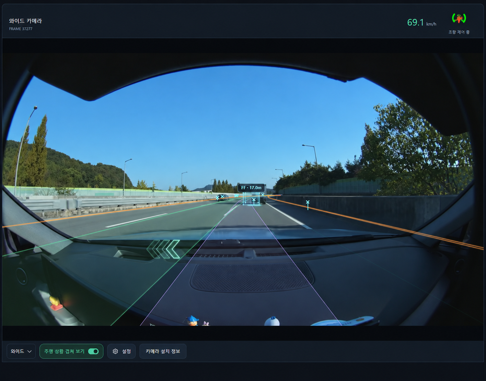
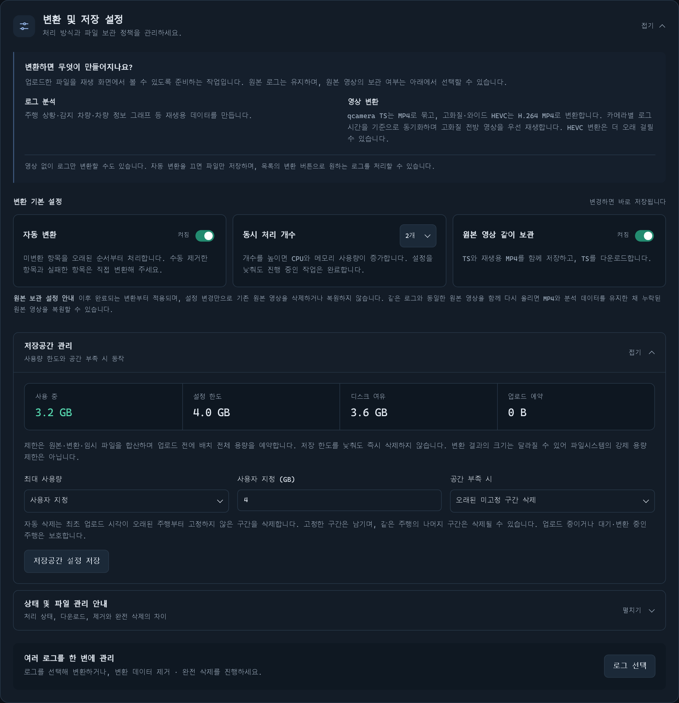
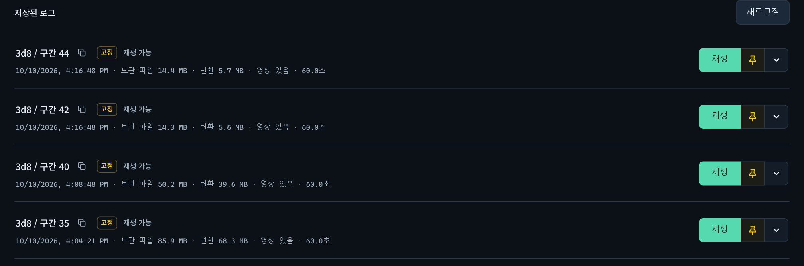

# Road Viewer for Home Assistant

[한국어](README.md) · English

Feature reference: **0.5.4**

Upload openpilot driving logs and front/wide camera recordings to **replay video, road views and vehicle information graphs on the same timeline inside Home Assistant**.

**Camera overlay and vehicle graphs**

Compare lanes, vehicle boxes and blind-spot indications over the front video with vehicle graphs at the same instant. Seeking moves the video and graphs together.



**Camera overlay and road view**

Switch the right panel to the road view to compare a top-down view of lanes, paths and radar detections with the video. The tables below expose individual radarState and liveTracks values. These screenshots demonstrate the two panel choices; graph selection and display items are configurable.



## Getting started

1. Add `https://github.com/Qualified4/roadviewer-ha` under Home Assistant **Settings → Apps → App store → ⋮ → Repositories**. Some versions call apps “add-ons.”
2. Install **Road Viewer**, start it and open its web UI.
3. Select files with **파일 추가** (Add files) or drag them into the upload area, then press **업로드** (Upload).
4. When conversion finishes, press **재생** (Play). If automatic conversion is disabled, first press **변환** (Convert).

This is an **app-store repository, not a HACS integration**. The web UI uses Home Assistant Ingress, including your existing remote Home Assistant address; no separate external port is needed. Home Assistant Container has no Supervisor app store.

## Platforms and installation

| Home Assistant architecture | Image platform | Devices |
|---|---|---|
| `amd64` | `linux/amd64` | 64-bit Intel/AMD PCs, mini PCs and servers |
| `aarch64` | `linux/arm64` | 64-bit ARM Home Assistant devices |

Installation downloads **only the matching prebuilt GHCR image**, not every published architecture. ARM 32-bit and i386 are unsupported. Prebuilt images avoid compiling the application on your device. Home Assistant may show download/extraction progress; its presentation depends on Supervisor and is not an exact percentage of total installation time.

## Supported uploads

**Local files and direct device uploads**

The upper area accepts selected or dropped files. Below it, **External device connection** is expanded: configure HTTPS and its port on the left, then pair or manage devices on the right. Ports and device identifiers are masked in this screenshot. Browser file uploads do not require enabling external device access.



The log is required; include whichever cameras you need from the same segment.

| File | Purpose |
|---|---|
| `rlog.zst` | Driving log |
| `qcamera.ts` | Low-bandwidth front video |
| `fcamera.hevc` | High-quality front video |
| `ecamera.hevc` | Wide video |

For one segment, bare filenames work. For multiple segments, retain their identifiers:

```text
00000395--0d0eda17c5--7--rlog.zst
00000395--0d0eda17c5--7--qcamera.ts
00000395--0d0eda17c5--7--fcamera.hevc
00000395--0d0eda17c5--7--ecamera.hevc
00000395--0d0eda17c5--8--rlog.zst
00000395--0d0eda17c5--8--qcamera.ts
```

- Logs alone support road views and vehicle graphs. Video-only and direct MP4 uploads are unsupported.
- Add a camera later by uploading it with the identical log; it attaches to the existing recording.
- If an original was removed but its MP4 remains, resending the log and matching TS/HEVC restores only the original after checking its stored hash. Existing MP4 and analysis remain intact.
- Compressed-log SHA-256 identifies duplicates at registration, after transfer.
- Browser uploads default to **512 MiB per batch**, configurable through `max_upload_mb` from 16–2048. This is separate from the storage budget. Device uploads support 8 GiB per batch, 50 segments, 200 files and 2 GiB per video; each log must fit `max_upload_mb`.

## Connecting a comma device

For direct device uploads, enable HTTPS in **로그 업로드 → 외부 장치 연결**, save a port and apply it with **지금 재시작** (Restart now). A valid certificate under `/ssl` is required. External access defaults to off and is not needed for the Ingress UI.

Pairing supports code copy, remaining time and reissue. Codes last five minutes and work once; a replacement invalidates the old code. The API uses HMAC authentication and resumable chunk uploads. A compatible Carrot Web uploader can include optional high-quality front/wide files alongside the log/qcamera, skipping missing cameras. Video conversion runs on Road Viewer, not the driving device.

**Pairing a comma device**

**Add device** opens this dialog. Copy the highlighted one-time code into the device connection screen and check its remaining lifetime and pairing status. The pictured code is illustrative; generate a new code for an actual connection. Unlike the HTTPS port settings, this dialog authenticates and registers a device.



## Playback and analysis

| Feature | Capabilities |
|---|---|
| Synchronized playback | Video with road view or vehicle graphs, up to 4× speed |
| Layout | Automatic, side-by-side or stacked; adjustable width for phone, tablet and desktop |
| Road view | Lanes, road edges, model paths, leads and radar detections |
| Vehicle information | 23 selectable, reorderable graphs |
| Navigation and pins | Segment selector, previous/next recording and per-segment pins |
| Scrolling | Sticky navigation and playback controls; collapsible navigation buttons |

**Wide-camera playback and overlays**

Upload `ecamera.hevc` with the log to select **와이드** (Wide) below the video. This example shows lanes, road edges, the model path, a vehicle box, radar detections and a turn signal over the wider field of view. The overlay uses the wide camera's sensor and calibration; switching back to the front video preserves the log position.



The default camera preference is high-quality front → qcamera → wide. Switching preserves log time and playing/paused state. A failing video triggers an attempt to use another available source. Wide overlays use the wide sensor/calibration; missing information produces an explanation. Older prepared logs may need reanalysis to obtain wide calibration.

Overlay settings control box height/opacity, path width, BSD wall height and individual labels. LF/FF/RF boxes reconstruct supported CCNC display commands recorded in the log. BSD, turn signals and target distance appear when the corresponding data is available. Camera overlays are independent of the road panel's 25/50/80m range; BSD walls retain a 40m limit.

Layout, display selections, graph order and collapsed sections are remembered in the current browser. Library and playback pins share the same per-segment setting.

## Conversion and file management

**Conversion behavior and storage policy**

Set automatic conversion, concurrent jobs and original-video retention in **Conversion and storage settings**. The expanded **Storage management** section shows usage and free space and configures the budget and full-storage policy. These settings differ from the per-recording actions below. Sizes and selected values reflect the example installation at capture time.



**변환 및 저장 설정** (Conversion and storage settings) provides automatic conversion, 1–4 concurrent jobs and original-video retention. qcamera TS is remuxed to MP4; front/wide HEVC is transcoded to H.264 MP4, requiring more processing. Replay analysis is gzip-compressed.

Original retention defaults to on. When off, successfully converted and verified TS/HEVC originals are removed. Changing the setting does not immediately delete existing originals. **영상 다운로드** (Download video) checks front → qcamera → wide and prefers that camera's original, otherwise its MP4.

Progress uses stage weights: log reading 25%, analysis 50–75% based on analyzed/total frames, video processing/verification 75–100%. The bar is hidden during finalization. These percentages are not a remaining-time estimate.

| Action | Effect |
|---|---|
| Remove prepared data | Preserve original logs/videos and each camera's sole MP4; remove analysis/graphs and reproducible MP4s. Cancel queued work; reject removal while processing |
| Completely delete | Delete all originals and prepared files for the segment |
| Clean storage now | Preserve registered recordings and clean incomplete browser-upload temporary files |

**Segment status and file management**

Each row shows processing status, video availability and retained/prepared file sizes. Ready entries offer **Play**, while entries needing preparation offer **Convert**. Pin individual segments and use the adjacent dropdown for downloads, removal and complete deletion.



Use **로그 선택** (Select logs) at the bottom of settings for bulk conversion/removal/deletion. Pinned segments are excluded from bulk removal/deletion by default. **고정 항목도 삭제** explicitly includes them for that dialog session; reopening restores protection. Individual menus allow explicit deletion of pinned recordings.

Storage management sets a budget and chooses rejection of new uploads or deletion of old unpinned segments. Automatic deletion groups by original route and orders by upload time. Reservations alone never delete recordings: eviction happens only after receipt and validation, during registration. Pins, queued/processing routes and other protected data remain excluded. Actual disk headroom is still required. The budget is an upload admission check, not a hard filesystem quota for subsequent conversion output.

## Storage, backups and updates

Files reside under `/data/roadviewer` inside the app container. **Home Assistant app backups exclude original logs, videos and prepared data.** Keep originals separately. Processing/storage policies and device authentication configuration are included.

An update that changes the analysis format may clear prepared data and reprocess recordings. Rendering-only updates do not inherently require reconversion.

## Documentation and validation

- [User guide](roadviewer/DOCS.en.md) · [한국어](roadviewer/DOCS.md): installation, playback, conversion, storage, backups and troubleshooting
- [Device API v1](docs/device-api.en.md) · [한국어](docs/device-api.md): HTTPS, pairing/signing, upload recovery and tests without openpilot
- [Changelog (Korean)](roadviewer/CHANGELOG.md)

`roadviewer/` is the Docker build context. GitHub Actions checks both architectures, Python dependencies, container vulnerabilities, real container HTTPS isolation, uploads, conversion and browser behavior. Actual Home Assistant devices and Android's native file picker may behave differently from browser tests.

### Prebuilt release workflow

The version comes from `roadviewer/config.yaml`. Full validation runs on the PR. Successful Python/browser/security/container tests produce both tested images as artifacts. Manual publication reuses these images without rebuilding. Ordinary branch pushes do not duplicate testing; `main` verifies the published image/source match instead of rebuilding or publishing again.

1. Update the app version, Dockerfile default, UI version and changelog on a release branch. Never reuse a published version.
2. Push and open a PR against `main`. After full validation succeeds, manually run **Build, test and publish app** on that branch. It requires the latest successful PR validation for the current commit and uses that run/attempt's image artifacts.
3. Ensure the GHCR package is public under **Packages → roadviewer-ha → Package settings → Change visibility → Public**. If public-access verification fails on a new package, make it public and rerun the failed publish job. Home Assistant does not need registry credentials.
4. After publication and anonymous access/platform checks succeed, squash-merge the tested changes unchanged. Main verifies both image versions and source trees; a different squash commit ID is acceptable when file contents match. Publishing the version on main before the images exist can break installation/update checks.

Artifacts expire after seven days. If missing or the latest validation failed/cancelled, use **Re-run all jobs** on the PR. Rerunning only failed jobs can leave the new attempt without both image artifacts. If the tested PR merge tree differs from the release branch, synchronize with main and validate again. New commits cancel superseded PR validation.

Temporary tags use `build-<validation-run>-<attempt>-amd64` / `arm64`. Release assembly references image digests; Home Assistant uses version tags. Existing versions are verified, not overwritten. For local source builds, follow the user guide's instructions to remove `image:` from the local app configuration.

Road Viewer is distributed under the [MIT license](LICENSE). Raw driving logs/videos are not included in the repository; the introduction uses selected public screenshots. See [OPENPILOT-LICENSE](roadviewer/schema/OPENPILOT-LICENSE) for bundled schema and UI-resource licensing.
